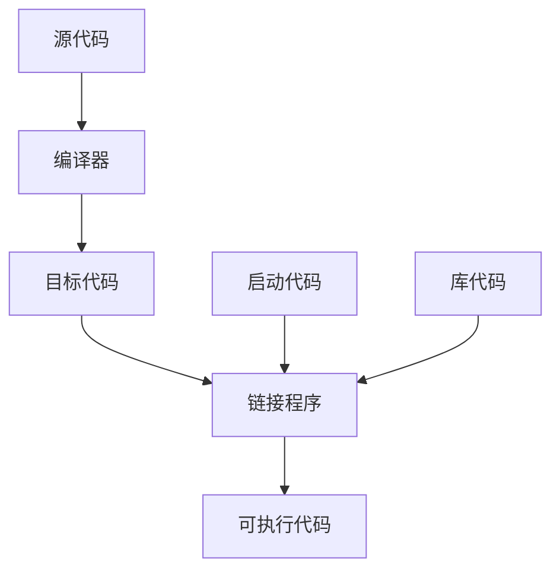

# 第一章 预备知识

## C++的三件法宝
**1 面向对象OOP**

目标：使**重用代码**和**抽象通用概念**的技术更简单。

理念：设计与问题本质特性相对应的数据格式

类：描述新型数据格式的一种**规范**

多态：为函数和运算符创建多个定义，通过编程上下文来确定使用哪个定义。


**2 模板**

**3 泛型编程**

OOP强调的是编程的数据，泛型编程强调的是独立于特定数据类型。

OOP是管理大型项目的工具，而泛型编程提供了用于执行常见任务的工具。

## C++与C
C++几乎兼容C的所有操作，**C部分赋予了C++紧密联系硬件的联系**，而OOP部分赋予了C++降问题所涉及的概念进行高级抽象的能力，因此，造就了C++的广泛传播

程序 = 数据 + 算法， **C语言更强调算法和过程， C++更注重数据**。因此，C语言是自上而下，而C++是自下而上。

## 可移植性与标准

ISO++标准(C++98/03和C++11)为保证在不同计算机硬件平台、软件实现之间的可兼容性

## 创建可执行程序的过程

```flow
st=>start: Start
op=>operation: Your Operation
cond=>condition: Yes or No?
e=>end
st->op->cond
cond(yes)->e
cond(no)->op
```

